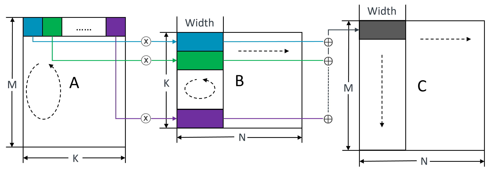
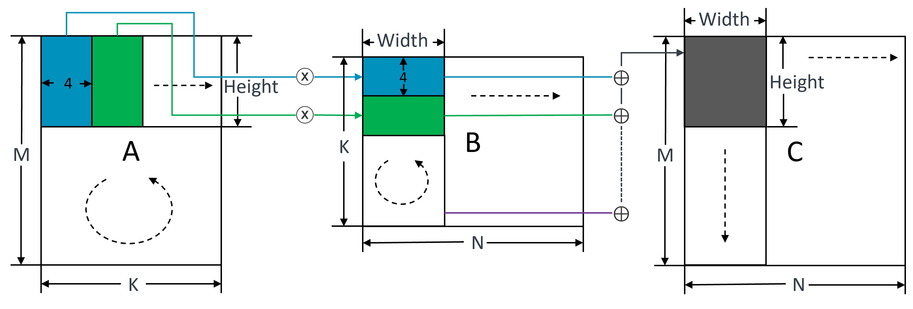
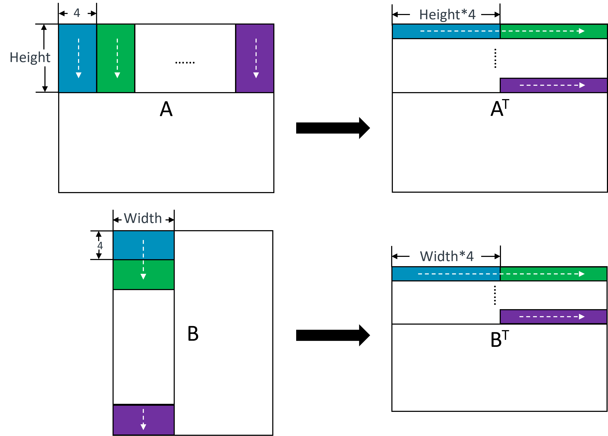

# Matix Multiplication

## Comparison

| Implementation     | Time (ms) | L1D_CACHE_REFILL | L1D_CACHE      | ASE/SVE_INST_SPEC | instructions   | IPC  |
| :----------------- | --------: | ---------------: | -------------: | ----------------: | -------------: | ---: |
| oneDNN + ACL       |      1194 |       23,300,620 |  3,055,194,919 |    15,612,378,504 | 17,847,690,729 | 2.60 |
| baseline           |      3262 |       76,227,001 | 30,870,843,994 |    12,584,646,907 | 64,263,485,205 | 3.47 |
| panel-24           | 1368~1510 |       40,233,188 | 13,887,671,454 |    12,422,123,164 | 24,884,657,231 | 2.94 |
| panel-24-asm       | 1171~1326 |       41,480,219 | 12,865,573,302 |    12,426,959,731 | 22,831,047,781 | 3.05 |
| tile-8x8           | 1170~1199 |      335,659,618 |  3,122,645,048 |    12,405,379,865 | 17,310,121,321 | 2.58 |
| tile-8x8-asm       | 1168~1202 |      317,043,906 |  3,124,567,338 |    12,430,691,985 | 16,607,189,899 | 2.49 |
| tile-8x8-transpose |      1143 |       60,262,936 |  3,226,760,043 |    12,431,025,407 | 15,252,986,969 | 2.35 |

## Baseline

## Panel

## Tile

### Pre-transpose

